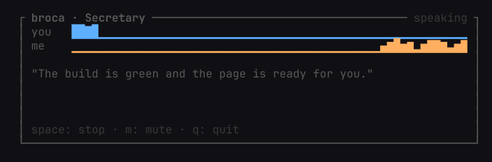
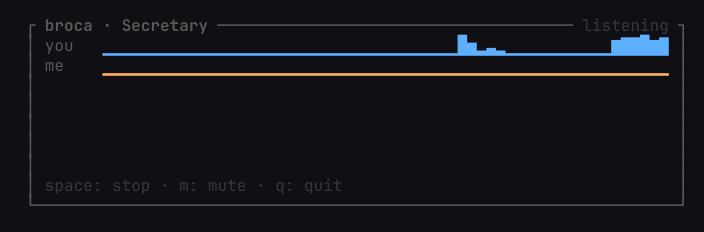

# Broca

A mouth and a pair of ears for one Claude Code chat: it speaks the chat's spoken lines aloud and draws both voices as waves in a terminal pane.




## How it works

- It tails the chat's transcript file (`~/.claude/projects/<folder>/<session>.jsonl`), which Claude Code appends to as the chat writes.
- A line that begins with `» ` is the spoken line; nothing else is spoken.
- The text goes to edge-tts, the audio is decoded by ffmpeg to PCM and played by pw-play, and Broca reads the loudness on the way for the "me" wave.
- pw-record gives the microphone's loudness for the "you" wave; nothing is recorded.

The first sound comes 1 to 3 seconds after the line lands, and a sentence costs about 70 KB of data.

## The rule for the chat

The chat starts a reply that holds real information with one `» ` paragraph in plain terms. The rest stays on screen. See `docs/rule.md`.

## Run it

Requirements: Linux with PipeWire, Node 25 or newer, `uv` (for `uvx edge-tts`), and `ffmpeg`. Nothing to install: Node runs the `.ts` files directly.

```
bin/broca <session-id>
bin/broca --cwd <dir>        # the newest chat started in that folder
bin/broca --say "hello"      # say one line and exit: a voice check
```

Keys: `space` stops the current speech and drops the queue, `m` mutes (lines still show on the pane), `q` quits.

Settings go in the optional file `~/.config/broca/settings.json`. Every key is optional; a key with the wrong type is ignored.

| key | default | meaning |
| --- | --- | --- |
| `voice` | `en-US-BrianMultilingualNeural` | an edge-tts voice; a Multilingual one says Turkish too |
| `ttsCommand` | `uvx` | the program that runs edge-tts |
| `ttsArgs` | `["edge-tts"]` | its leading arguments |
| `player` | `pw-play` | `pw-play` or `mpv` |
| `voiceStop` | `false` | cut speech when you start talking; off because speakers would feed Broca's voice back |
| `listenRatio` | `3` | how many times louder than the room's noise counts as you talking |
| `clearAfterMs` | `3000` | how long the sentence stays on the pane after it ends |
| `projectsDir` | `~/.claude/projects` | where chats are looked for |

## What leaves the machine

Only the spoken text, sent to Microsoft's online voice through edge-tts. The microphone is never recorded: only its loudness is read, and nothing is kept.

## Tests

```
node --test 'tests/*.test.ts'
npm run typecheck
```

The typecheck needs TypeScript and the Node types installed first: `npm install --no-save typescript @types/node`.

## Not yet

Turkish, a second chat at once, a plugin that switches Broca on for any chat, clickable choices, anything that writes into the chat.

## Credits

See `CREDITS.md`.
